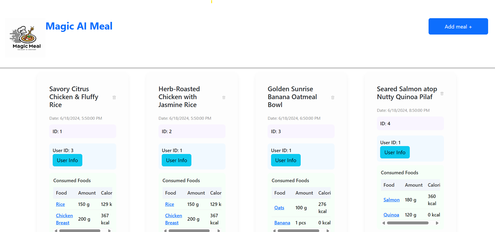

# meal-assist-v2

**React Exercise**

---

## Project Setup

1. Install dependencies:
   npm install

2. Start local dev server:
   npx json-server --watch db.json -p 3200

3. Start the React dev server:
   npm run dev

4. Open the app in your browser:

http://localhost:5173/

### Available Endpoints:

    http://localhost:5173/
    http://localhost:5173/meal
    http://localhost:5173/meal/{mealId}
    http://localhost:5173/meal/new
    http://localhost:5173/user
    http://localhost:5173/user/{userId}
    http://localhost:5173/food
    http://localhost:5173/food/{foodId}

